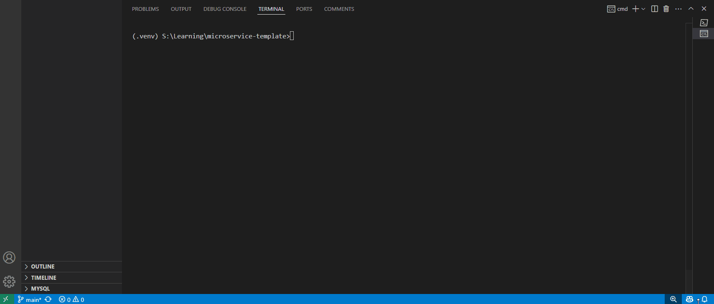
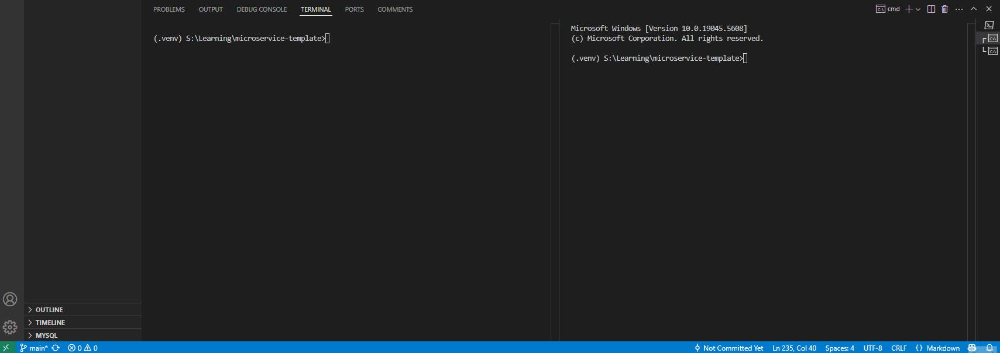
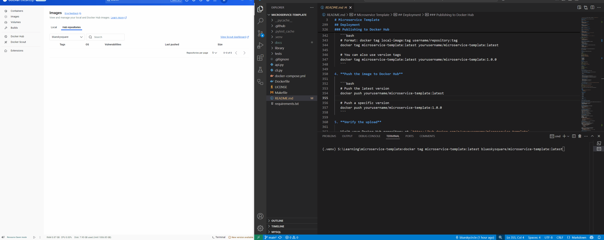

[](https://github.com/blueskycircle/microservice-template/actions/workflows/main.yml)

# Microservice Template

A comprehensive template for building Python microservices with CLI capabilities, FastAPI, testing, and containerization.

## Table of Contents
- [Overview](#overview)
- [Features](#features)
- [Prerequisites](#prerequisites)
- [Setup and Installation](#setup-and-installation)
- [Project Structure](#project-structure)
- [CLI Usage](#cli-usage)
- [API Documentation](#api-documentation)
  - [Running the API](#running-the-api)
  - [API Endpoints](#api-endpoints)
  - [Using curl with the API](#using-curl-with-the-api)
  - [Swagger Documentation](#swagger-documentation)
- [Testing](#testing)
- [Deployment](#deployment)
  - [Using Docker](#using-docker)
  - [Using Docker Compose](#using-docker-compose)
  - [Publishing to Docker Hub](#publishing-to-docker-hub)
  - [Using Your Docker Hub Image](#using-your-docker-hub-image)
- [Development Workflow](#development-workflow)
- [Customizing the Template](#customizing-the-template)
- [Visual Demonstrations](#visual-demonstrations)
  - [CLI Usage Example](#cli-usage-example)
  - [API Endpoint Example](#api-endpoint-example)
  - [Docker Examples](#docker-examples)

## Overview

This template provides a foundation for building microservices in Python, featuring both a REST API (using FastAPI) and a command-line interface (using Click). It includes best practices for testing, linting, containerization, and CI/CD integration.

## Features

- **FastAPI Backend**: High-performance REST API with automatic OpenAPI documentation
- **CLI Interface**: Command-line tool for the same functionality
- **Precise Arithmetic**: Uses Python's `Decimal` type for accurate floating-point calculations
- **Testing Framework**: Comprehensive testing with pytest
- **Code Quality**: Linting with pylint and formatting with black
- **Containerization**: Docker and docker-compose setup
- **CI/CD**: GitHub Actions workflow
- **Modular Structure**: Well-organized code for easy extension

## Prerequisites

- Python 3.11+ (3.13 recommended)
- pip (latest version)
- Docker and docker-compose (for containerization)
- Git (for version control)

## Setup and Installation

### Local Development Setup

1. **Clone the repository**
   ```bash
   git clone <repository-url>
   cd microservice-template
   ```

2. **Check available Python versions**
   ```bash
   py --list
   ```

3. **Create a virtual environment**
   ```bash
   pip install virtualenv
   py -3.13 -m venv .venv
   ```

4. **Activate the virtual environment**
   - Windows:
     ```bash
     .venv\Scripts\activate
     ```
   - Unix/macOS:
     ```bash
     source .venv/bin/activate
     ```

5. **Verify Python version**
   ```bash
   python --version
   ```

6. **Install dependencies**
   ```bash
   make install
   ```
   or
   ```bash
   pip install --upgrade pip
   pip install -r requirements.txt
   ```

## Project Structure

```
microservice-template/
├── .github/workflows/   # GitHub Actions CI/CD configuration
├── library/             # Core functionality
│   ├── __init__.py
│   └── methods.py       # Business logic implementations
├── tests/               # Test suite
│   ├── test_api.py      # API tests
│   ├── test_cli.py      # CLI tests
│   └── test_methods.py  # Unit tests for core functions
├── .gitignore           # Git ignore file
├── api.py               # FastAPI implementation
├── cli.py               # Click CLI implementation
├── docker-compose.yml   # Docker Compose configuration
├── Dockerfile           # Docker configuration
├── Makefile             # Development automation
├── README.md            # Project documentation
└── requirements.txt     # Python dependencies
```

## CLI Usage

The CLI tool provides the same mathematical operations through a command-line interface.

### Basic Commands

```bash
# For help
python cli.py --help

# Addition
python cli.py addition 2 3.6

# Subtraction
python cli.py subtraction 5 3

# Working with negative numbers
python cli.py addition -- -1 2.3
python cli.py subtraction -- -5 -3.3
```

### Floating-Point Precision

This microservice uses Python's `Decimal` type internally to handle floating-point calculations accurately. Unlike standard floating-point arithmetic, which may produce results like `0.1 + 0.2 = 0.30000000000000004`, this implementation ensures precise decimal representation.

For example:
```bash
# Standard floating-point would normally give 1.2999999999999998
python cli.py addition 1.2 0.1  # Correctly outputs 1.3

# Standard floating-point would normally give 0.30000000000000004
python cli.py addition 0.1 0.2  # Correctly outputs 0.3
```

## API Documentation

The API provides mathematical operations through RESTful endpoints.

### Running the API

```bash
python api.py
```

Or using Docker:

```bash
docker-compose up
```

### API Endpoints

| Endpoint | Method | Description | Request Body | Example |
|----------|--------|-------------|-------------|---------|
| `/` | GET | Welcome message | None | `GET /` |
| `/add` | POST | Add two numbers | `{"a": float, "b": float}` | `POST /add {"a": 0.1, "b": 0.2}` |
| `/subtract` | POST | Subtract two numbers | `{"a": float, "b": float}` | `POST /subtract {"a": 1.2, "b": 0.1}` |
| `/add/{a}/{b}` | GET | Add two numbers | Path parameters | `GET /add/0.1/0.2` |
| `/subtract/{a}/{b}` | GET | Subtract two numbers | Path parameters | `GET /subtract/1.2/0.1` |

### Using curl with the API

You can interact with the API directly from the command line using curl:

#### Welcome Message
```bash
curl http://localhost:8000/
```

#### Addition (POST method with JSON body)
```bash
curl -X POST \
  http://localhost:8000/add \
  -H "Content-Type: application/json" \
  -d '{"a": 5, "b": 3}'
```

#### Subtraction (POST method with JSON body)
```bash
curl -X POST \
  http://localhost:8000/subtract \
  -H "Content-Type: application/json" \
  -d '{"a": 10, "b": 4}'
```

#### Addition (GET method with path parameters)
```bash
curl http://localhost:8000/add/5/3
```

#### Subtraction (GET method with path parameters)
```bash
curl http://localhost:8000/subtract/10/4
```

#### Addition with Floating-Point Precision
```bash
curl -X POST \
  http://localhost:8000/add \
  -H "Content-Type: application/json" \
  -d '{"a": 0.1, "b": 0.2}'
# Output: {"operation": "addition", "a": 0.1, "b": 0.2, "result": 0.3}
```

#### Subtraction with Floating-Point Precision
```bash
curl -X POST \
  http://localhost:8000/subtract \
  -H "Content-Type: application/json" \
  -d '{"a": 1.2, "b": 0.1}'
# Output: {"operation": "subtraction", "a": 1.2, "b": 0.1, "result": 1.1}
```

#### Working with Negative Numbers
```bash
# Using path parameters
curl http://localhost:8000/add/-5/3.333

# Using JSON body
curl -X POST \
  http://localhost:8000/subtract \
  -H "Content-Type: application/json" \
  -d '{"a": -5, "b": 3}'
```

#### Windows Command Prompt Specific Examples
For Windows Command Prompt, use double quotes for the JSON data:

```cmd
curl -X POST ^
  http://localhost:8000/add ^
  -H "Content-Type: application/json" ^
  -d "{\"a\": 5, \"b\": 3.3}"
```

#### PowerShell Specific Examples
For PowerShell, use backticks for line continuation and escape quotes properly:

```powershell
curl -X POST `
  http://localhost:8000/add `
  -H "Content-Type: application/json" `
  -d '{"a": 5, "b": 3}'
```

### Swagger Documentation

When the API is running, access the auto-generated Swagger documentation at:
```
http://localhost:8000/docs
```

## Testing

This template includes comprehensive testing with pytest.

### Running Tests

```bash
# Run all tests
make test

# Or directly with pytest
python -m pytest -vv tests/test_*.py

# Run specific test files
python -m pytest -vv tests/test_api.py
python -m pytest -vv tests/test_cli.py
python -m pytest -vv tests/test_methods.py
```

### Test Coverage

The tests cover:
- API endpoints
- CLI commands
- Core functionality
- Error handling
- Edge cases

## Deployment

### Using Docker

Build and run the Docker container:

```bash
# Build the Docker image
docker build -t microservice-template .

# Run the container
docker run -p 8000:8000 microservice-template
```

### Using Docker Compose

```bash
# Start services
docker-compose up

# Start services in detached mode
docker-compose up -d

# Stop services
docker-compose down
```

### Publishing to Docker Hub

To make your containerized microservice available to others:

1. **Create a Docker Hub account**
   
   Sign up at [Docker Hub](https://hub.docker.com/) if you don't have an account.

2. **Log in to Docker Hub from the command line**

   ```bash
   docker login
   ```

3. **Tag your Docker image**

   ```bash
   # Format: docker tag local-image:tag username/repository:tag
   docker tag microservice-template:latest blueskysquare/microservice-template:latest
   
   # You can also use version tags
   docker tag microservice-template:latest blueskysquare/microservice-template:1.0.0
   ```

4. **Push the image to Docker Hub**

   ```bash
   # Push the latest version
   docker push blueskysquare/microservice-template:latest
   
   # Push a specific version
   docker push blueskysquare/microservice-template:1.0.0
   ```

5. **Verify the upload**
   
   Visit your Docker Hub repository at `https://hub.docker.com/r/blueskysquare/microservice-template`

### Using Your Docker Hub Image

Others can now use your microservice by pulling the image:

```bash
# Pull the image
docker pull blueskysquare/microservice-template:latest

# Run the container
docker run -p 8000:8000 blueskysquare/microservice-template:latest
```

For docker-compose users, they can reference your image in their docker-compose.yml:

```yaml
version: '3'

services:
  math-api:
    image: yourusername/microservice-template:latest
    ports:
      - "8000:8000"
    restart: unless-stopped
```

## Development Workflow

1. **Code Formatting**
   ```bash
   make format
   ```

2. **Linting**
   ```bash
   make lint
   ```

3. **Testing**
   ```bash
   make test
   ```

4. **Complete Workflow**
   ```bash
   make all
   ```

## Customizing the Template

To adapt this template for your own microservice:

### Runbook: Adding a New Mathematical Operation

This runbook provides step-by-step instructions for adding a new mathematical operation (multiplication) to the microservice.

#### Prerequisites
- Working installation of the microservice template
- Basic understanding of Python
- Familiarity with FastAPI and Click frameworks
- Access to edit the codebase

#### Procedure

**STEP 1: Implement Core Function**
| Task | Add the multiplication function to the core library |
|------|---------------------------------------------------|
| File | `library/methods.py` |
| Action | Add the following function: |
```python
def multiply(a, b):
    """Multiply two numbers and return the result."""
    return a * b
```
| Validation | No syntax errors when saving the file |

**STEP 2: Update Import Statements**
| Task | Update imports in API and CLI files |
|------|-----------------------------------|
| Files | `api.py` and `cli.py` |
| Action | Locate the import statement at the top of each file: |
```python
from library.methods import add, subtract
```
| Action | Modify to include the new function: |
```python
from library.methods import add, subtract, multiply
```
| Validation | No syntax errors when saving the files |

**STEP 3: Add CLI Command**
| Task | Add multiplication command to CLI |
|------|----------------------------------|
| File | `cli.py` |
| Action | Add the following code block after existing commands: |
```python
@cli.command()
@click.argument("a", type=float)
@click.argument("b", type=float)
def multiplication(a, b):
    """Multiply two numbers and display the result.

    Example: python cli.py multiplication 2 3
    For negative numbers, use: python cli.py multiplication -- -5 3
    """
    result = multiply(a, b)
    click.echo(result)
```
| Validation | Run `python cli.py --help` to verify the new command appears |

**STEP 4: Add API Endpoints**
| Task | Add multiplication endpoints to the API |
|------|-----------------------------------------|
| File | `api.py` |
| Action | Add the following POST endpoint after existing endpoints: |
```python
@app.post("/multiply", response_model=CalculationResponse)
def multiplication(request: CalculationRequest):
    """Multiply two numbers and return the result."""
    result = multiply(request.a, request.b)
    return {
        "operation": "multiplication",
        "a": request.a,
        "b": request.b,
        "result": result,
    }
```
| Action | Add the following GET endpoint after existing endpoints: |
```python
@app.get("/multiply/{a}/{b}", response_model=CalculationResponse)
def multiplication_get(a: float, b: float):
    """Multiply two numbers using GET request."""
    result = multiply(a, b)
    return {"operation": "multiplication", "a": a, "b": b, "result": result}
```
| Validation | No syntax errors when saving the file |

**STEP 5: Create Unit Tests**
| Task | Add test for the core function |
|------|------------------------------|
| File | `tests/test_methods.py` |
| Action | Add the following test function: |
```python
def test_multiply():
    """Test the multiply function."""
    assert multiply(2, 3) == 6, "Should be 6"
    assert multiply(-1, 1) == -1, "Should be -1"
    assert multiply(0, 5) == 0, "Should be 0"
    assert multiply(2.5, 4) == 10.0, "Should be 10.0"
```
| Validation | Run `pytest tests/test_methods.py -v` to verify the test passes |

**STEP 6: Create CLI Tests**
| Task | Add tests for the CLI command |
|------|------------------------------|
| File | `tests/test_cli.py` |
| Action | Add the following test function: |
```python
def test_multiplication_command(runner):
    """Test the multiplication command with various inputs."""
    # Test with positive integers
    result = runner.invoke(cli, ["multiplication", "2", "3"])
    assert result.exit_code == 0
    assert "6.0" in result.output

    # Test with negative numbers
    result = runner.invoke(cli, ["multiplication", "--", "-2", "3"])
    assert result.exit_code == 0
    assert "-6.0" in result.output

    # Test with decimals
    result = runner.invoke(cli, ["multiplication", "2.5", "4"])
    assert result.exit_code == 0
    assert "10.0" in result.output
```
| Validation | Run `pytest tests/test_cli.py -v` to verify the test passes |

**STEP 7: Create API Tests**
| Task | Add tests for the API endpoints |
|------|--------------------------------|
| File | `tests/test_api.py` |
| Action | Add the following test functions: |
```python
def test_multiplication_post(client):
    """Test the multiplication endpoint with POST method."""
    # Test with positive integers
    response = client.post("/multiply", json={"a": 2, "b": 3})
    assert response.status_code == 200
    data = response.json()
    assert data["operation"] == "multiplication"
    assert data["a"] == 2
    assert data["b"] == 3
    assert data["result"] == 6

    # Test with negative numbers
    response = client.post("/multiply", json={"a": -2, "b": 3})
    assert response.status_code == 200
    data = response.json()
    assert data["result"] == -6

def test_multiplication_get(client):
    """Test the multiplication endpoint with GET method."""
    # Test with positive integers
    response = client.get("/multiply/2/3")
    assert response.status_code == 200
    data = response.json()
    assert data["operation"] == "multiplication"
    assert data["result"] == 6
```
| Validation | Run `pytest tests/test_api.py -v` to verify the tests pass |

**STEP 8: Run All Tests**
| Task | Verify all functionality works together |
|------|--------------------------------------|
| Action | Run complete test suite: |
```bash
make test
```
| Expected Result | All tests should pass without errors |

**STEP 9: Manual Testing**
| Task | Manually test the CLI |
|------|---------------------|
| Action | Run: |
```bash
python cli.py multiplication 2 3
```
| Expected Result | Output: `6.0` |

| Task | Manually test the API |
|------|---------------------|
| Action | Start the API and run curl commands: |
```bash
# Start the API
python api.py

# In another terminal, test the GET endpoint
curl http://localhost:8000/multiply/2/3

# Test the POST endpoint
curl -X POST http://localhost:8000/multiply -H "Content-Type: application/json" -d '{"a": 2, "b": 3}'
```
| Expected Result | Both commands should return JSON with the result of 6 |

#### Troubleshooting

| Issue | Solution |
|-------|----------|
| Import errors | Ensure proper imports in all files. Check for typos in function names. |
| Failed tests | Examine test output for specific failures. Verify expected vs. actual results. |
| API endpoint not found | Ensure the API server is running and endpoints are correctly defined. |
| CLI command not found | Check for typos in the command name and verify it's properly registered. |

#### Notes
- Remember to run code formatting (`make format`) and linting (`make lint`) after making changes
- If deploying the updated service, rebuild the Docker image
- Update API documentation to reflect the new endpoints

## Visual Demonstrations

The following visual demonstrations show the template in action, providing a clear picture of how the microservice works in practice.

### CLI Usage Example
This demonstration shows the command-line interface in action. The animation demonstrates how to run addition and subtraction operations.



### API Endpoint Example
This demonstration illustrates how to interact with the API endpoints using curl commands.



### Docker Examples
These demonstrations show the containerization capabilities of the microservice. The first animation demonstrates building and running the Docker container locally, while the second shows the process of publishing the container to Docker Hub.




